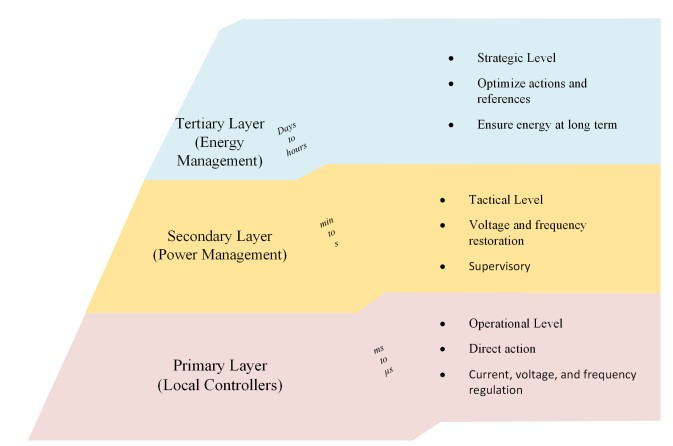
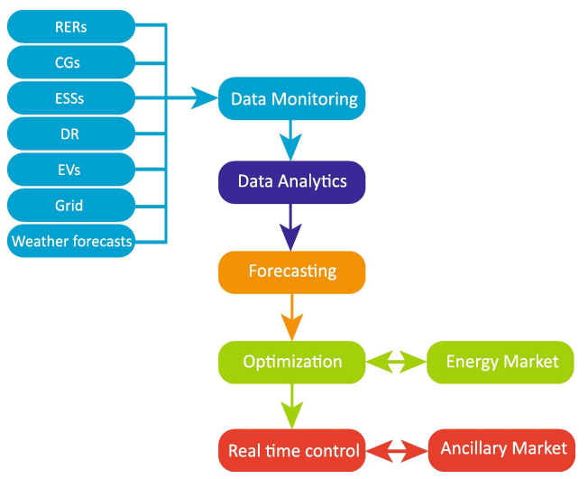

# Microgrids
## Introduction
Low-voltage and/or medium voltage grids equipped with additional installations aggregating and managing largely autonomously their own supply and demand-side resources, optionally also in the case of islanding.

Based on the standard IEEE 1547.4, a distributed islanded resources system, considered as Microgrid (MG) fulfills the conditions:
1. Integrate distributed energy resources (DERs) and loads;
2. Have the capability of being disconnected (in parallel) from the electric power system;
3. Contain the local electric power system and 
4. Be purposely planned \[[1](#ref-1)\].

A MG ensures continuous supply to critical loads in islanded mode with the effective **management of DERs**, **load shedding**, and **demand response (DR)**.

### **Load Shedding**  
Load shedding refers to a deliberate and temporary reduction or interruption of electrical power in a specific area or region to prevent a widespread blackout or system failure. It is a strategy employed by power utilities or grid operators to balance the supply and demand of electricity during periods of high demand or when the power generation capacity is limited.

Load shedding can be implemented manually, where operators make decisions on which areas or customers to temporarily disconnect based on predefined protocols and priorities. Alternatively, automated systems can be used to monitor the power grid and initiate load shedding automatically when certain predefined conditions or thresholds are met.

Load shedding is often employed as a measure of last resort when other methods, such as demand response, power imports, or power generation capacity upgrades, are insufficient to address the power system's immediate constraints.

### **Demand Response (DR)**
DR refers to a mechanism or strategy employed for managing electricity consumption in the context of a microgrid. It involves the voluntary participation of consumers in adjusting their electricity usage patterns in response to certain signals or incentives.

## Microgrid Energy Management
A single control and management system would not be able to make all the necessary decisions to implement a complex electric power system. Therefore, functions required for MG operation have been established under hierarchical dependence \[[2](#ref-2)\], \[[3](#ref-3)\]. In this way, the decision layers at a higher level of the hierarchy define the tasks and coordinate the lower-level layers.

||
|:-:|
|Hierarchical control from \[[4](#ref-4)\].|

The figure shows that the time-scales become shorter moving towards lower layers in the hierarchy. The primary layer contains the local controllers (LCs) and the typical response is between micro to milliseconds; The secondary layer is related to power management level that works for horizons between seconds to minutes; The tertiary layer refers to strategic energy management level. In this last layer, energy management executes decision-making with action times of hours to days. 

This architecture also increases the overall system reliability so that it can survive in case of disconnection or damage of one of the control units.

The International Electrotechnical Commission in the standard IEC 61970 in \[[5](#ref-5)\], related to  energy management system (EMS) application program interface in power systems management, defines an EMS as 
>“a computer system comprising a software platform providing basic support services and a set of applications providing the functionality needed for the effective operation of electrical generation and transmission facilities so as to assure adequate security of energy supply at minimum cost”.

A MG EMS performs variety of functions as monitoring, analyzing, and forecasting of power generation of RESs, load consumption, energy market prices, ancillary market prices, and meteorological factors as given by the figure below.

||
|:-:|
|Energy Management Functions \[[4](#ref-4)\]|

The EMS usually operates and coordinates energy components as DERs, loads, power converters and grid components in order to provide reliable, sustainable, and environmentally friendly energy in an optimal way \[[6](#ref-6)\]. It can be operated in both islanded and grid-connected. In **grid-connected** mode, the EMS can
be oriented to operate bundled in a DR program, promote self-consumption
or participate in the electricity market. Meanwhile, in the **islanded** mode an
MG EMS may be called on to perform unit commitment, economic dispatch,
and load control.

The supervisory control architecture of MG EMS can be divided into two types, namely, **centralized** and **decentralized** EMSs.

* In **centralized control**, the EMS collects all information and optimizes decision variables against defined, objective. These optimal set points are then sent to DERs LCs for necessary actions.
* In the **decentralized control** approach, the local controllers of the DERs interact with each other and with a central controller to operate MG, and this process continues until global and local objectives are achieved. Decentralized approaches are preferred in wide area applications
where communication links are not always suitable.

## Bibliography
### Previous reviews
Several papers addressed different aspects of MGs, as protection and control schemes for MG, reactive power compensation techniques
## References
### ref 1 
B. Kroposki, T. Basso, and R. DeBlasio, “Microgrid standards and technologies,” in 2008 IEEE Power and Energy Society General Meeting - Conversion and Delivery of Electrical Energy in the 21st Century, pp. 1–4, Jul 2008.

### ref 2
J. M. Guerrero, J. C. Vasquez, J. Matas, L. G. de Vicuna, and M. Castilla,
“Hierarchical control of droop-controlled ac and dc microgrids–a general approach toward standardization,” IEEE Transactions on Industrial Electronics, vol. 58, no. 1, pp. 158–172, 2011

### ref 3
T. L. Vandoorn, J. C. Vasquez, J. De Kooning, J. M. Guerrero, and
L. Vandevelde, “Microgrids: Hierarchical control and an overview of the control and reserve management strategies,” IEEE Industrial Electronics Magazine, vol. 7, no. 4, pp. 42–55, 2013

### ref 4
<a id="#ref1" href="/These-On-energy-management-optimization-for-microgrids-enriched-with-renewable-energy-sources-2020-ZIA_Muhammad_Fahad.pdf"> [1] On energy management for microgrids.</a>

### ref 5
IEC 61970: Energy management system application program interface (EMS-API). IEC, 2005.

### ref 6
F. Katiraei, R. Iravani, N. Hatziargyriou, and A. Dimeas, “Microgrids management,” IEEE Power and Energy Magazine, vol. 6, no. 3, pp. 54–65, 2008.